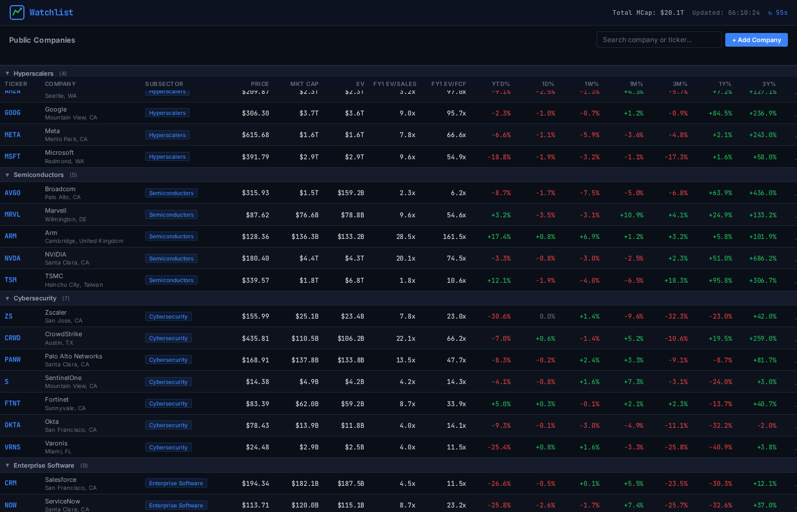
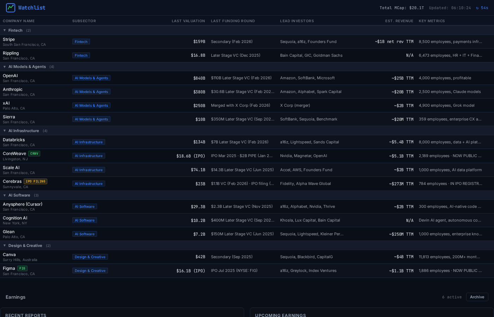
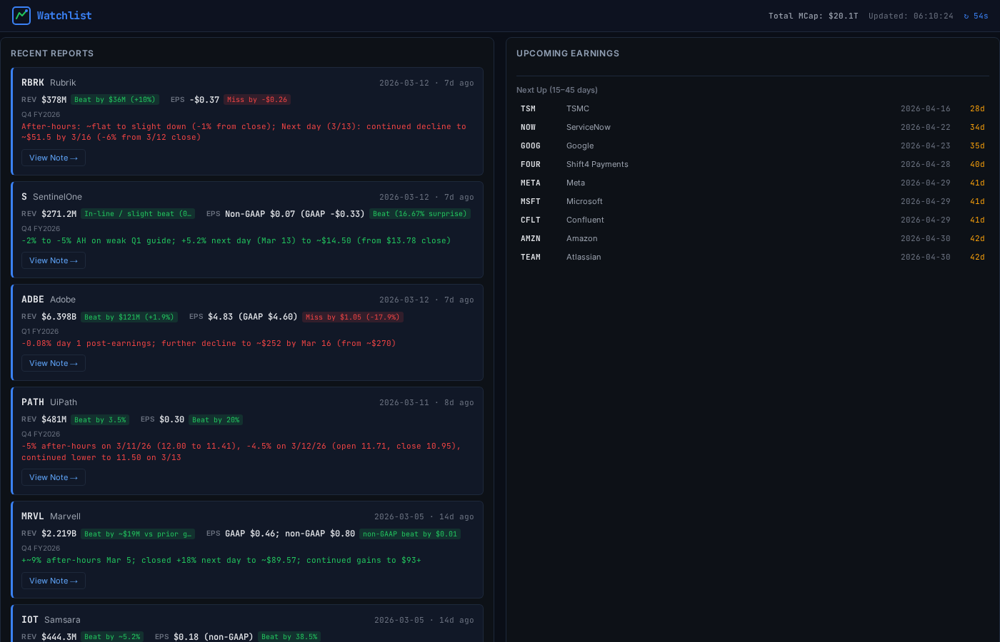

# SignalAI

A buy-side equity research terminal for tracking public and private technology companies. Built for fundamental analysts with a 1–3 year investment horizon.



## Features

### Public Companies Watchlist
- **45 pre-loaded tech tickers** across 12 subsectors (Hyperscalers, Semiconductors, Cybersecurity, Enterprise Software, etc.)
- Real-time prices, market cap, EV, EV/Sales, EV/FCF, and performance returns (1D through 3Y)
- Company headquarters displayed under each name
- Sortable columns with collapsible subsector grouping
- Add/remove tickers with live search autocomplete
- Click any ticker for a detailed popup with charts and fundamentals

### Private Companies Tracker
- **15 pre-loaded private companies** (OpenAI, Anthropic, Databricks, Stripe, etc.) with PitchBook-sourced data
- Last valuation, funding round, lead investors, revenue estimates, and key metrics
- Headquarters display and status badges for recently-IPO'd companies (CoreWeave, Figma) and IPO filings (Cerebras)



### Earnings Research (SignalAI)
- Automated pre-earnings and post-earnings research notes
- Pre-earnings notes: set-up, key debates, what matters this print, scenario grid (bull/base/bear)
- Post-earnings notes: headline results vs expectations, guidance and tone, thesis impact, follow-ups
- Earnings calendar with upcoming and recent reporters
- Archive system for older notes



### Additional Features
- **Market News** feed aggregated from watchlist tickers
- **Deep-dive popup** with quantitative factors, short interest, S&P 500 outperformance, and cross-sector comps (requires backend)
- **Dark terminal theme** with JetBrains Mono + Inter typography
- Auto-classification of new tickers into subsectors
- Persistent storage with migration system for seamless updates

## Quick Start

### Option 1: Live Demo

Try it now at **[wtlittle.github.io/signalai](https://wtlittle.github.io/signalai/)**

The demo loads with a cached data snapshot so the terminal populates instantly. If a CORS proxy is available, it will attempt to fetch live prices on top of the snapshot data.

### Option 2: Static Local (no backend)

Serve the files with any static file server:

```bash
# Using Python
python -m http.server 5000

# Using Node.js
npx serve . -l 5000
```

Then open [http://localhost:5000](http://localhost:5000).

> **Note:** The static version provides core functionality (prices, charts, performance). Advanced features like quantitative factor analysis, short interest data, cross-sector comps, and news require the Python backend.

### Option 3: Full Setup (with backend)

The Python backend provides richer data, faster batch fetching, and advanced analytics.

**Requirements:** Python 3.9+

```bash
# Install dependencies
pip install yfinance numpy ddgs

# Start the backend
python backend.py
# Backend runs on port 5001

# In another terminal, serve the frontend
npx serve . -l 5000
```

Open [http://localhost:5000](http://localhost:5000). The frontend will automatically detect and use the backend.

## Architecture

```
├── index.html          # Main HTML shell
├── styles.css          # Full terminal theme
├── utils.js            # Constants, formatters, storage, company data
├── api-client.js       # Client-side fallback (CORS proxy + snapshot)
├── api.js              # Data fetching layer (backend-first, client fallback)
├── data-snapshot.json  # Cached market data for instant demo loading
├── app.js              # Main app logic, rendering, state management
├── popup.js            # Ticker detail popup
├── popup-chart.js      # Interactive price charts (Chart.js)
├── popup-deep-dive.js  # Quantitative deep-dive analysis
├── earnings.js         # Earnings calendar and research notes
├── backend.py          # Python backend (yfinance, news, analytics)
├── earnings_calendar.json  # Pre-built earnings data
└── notes/              # Pre/post earnings research notes (Markdown)
    ├── pre_earnings/
    └── post_earnings/
```

### Data Flow

1. **With backend:** Frontend → Python backend (port 5001) → yfinance → Yahoo Finance APIs
2. **Without backend (CORS proxy available):** Frontend → `api-client.js` → CORS proxy → Yahoo Finance APIs
3. **Without backend (no proxy):** Frontend → `api-client.js` → `data-snapshot.json` (cached data)

The frontend automatically detects the best available data source. When running as a static demo, it loads a pre-cached snapshot instantly while optionally attempting live price updates through CORS proxies.

## Tech Stack

- **Frontend:** Vanilla HTML/CSS/JS, Chart.js for charts
- **Backend:** Python stdlib HTTP server, yfinance, numpy, DuckDuckGo search (ddgs)
- **Design:** Dark navy terminal theme (#0a0e17), JetBrains Mono monospace, Inter sans-serif
- **Storage:** localStorage with in-memory fallback (works in iframes)

## Private Company Data

Private company data is sourced from PitchBook Company Profiles and includes:
- Valuations and funding history
- Lead investors
- Revenue estimates (TTM)
- Employee counts
- Headquarters locations
- IPO status tracking

Data is embedded in `utils.js` as `DEFAULT_PRIVATE_COMPANIES` and can be updated manually or via the PitchBook API.

## License

MIT

---

Built with [Perplexity Computer](https://www.perplexity.ai/computer)
